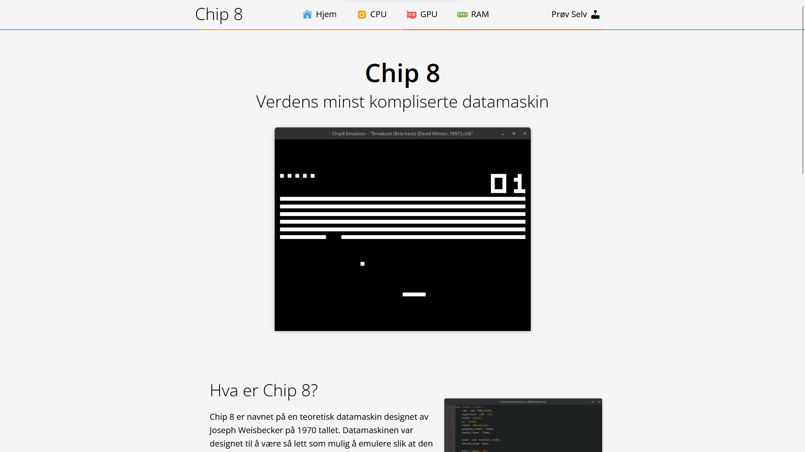

# [Chip8 Website](https://jovialen.github.io/chip8-website)

  

A simple website made for a school project explaining the inner workings of a computer with the Chip8 as an example.

## Resources

- https://www.diagrams.net/
- <a target="_blank" href="https://icons8.com/icon/pEiMVxBH7wDK/electronics">Electronics icon by Icons8</a>
- <a target="_blank" href="https://icons8.com/icon/B2PRRqjuZtEv/video-card">Video Card icon by Icons8</a>
- <a target="_blank" href="https://icons8.com/icon/jFD5FvqNIKDl/audio-wave">Audio Wave icon by Icons8</a>
- <a target="_blank" href="https://icons8.com/icon/0IolQYKA7OLQ/home-page">Home Page icon by Icons8</a>
- <a target="_blank" href="https://icons8.com/icon/S5biqohaDgd1/menu-rounded">Menu Rounded icon by Icons8</a>
- <a target="_blank" href="https://icons8.com/icon/4Sjrm3bwm9Lv/smartphone-ram">Smartphone RAM icon by Icons8</a>
- <a target="_blank" href="https://icons8.com/icon/9yIsjC9VistG/memory-slot">Memory Slot icon by Icons8</a>
- <a target="_blank" href="https://icons8.com/icon/SFam5RUt1kup/joystick">Joystick icon by Icons8</a>
- <a target="_blank" href="https://icons8.com/icon/Uh8hvgeb99i5/play">Play icon by Icons8</a>
- <a target="_blank" href="https://icons8.com/icon/fmFqQmR0UdsR/github">GitHub icon by Icons8</a>

## Sources

- https://en.wikipedia.org/wiki/Central_processing_unit
- https://en.wikipedia.org/wiki/Graphics_processing_unit
- https://en.wikipedia.org/wiki/CHIP-8
- http://devernay.free.fr/hacks/chip8/C8TECH10.HTM
- https://snl.no/CPU
- https://www.enterprisestorageforum.com/hardware/types-of-computer-memory/
- https://en.wikipedia.org/wiki/Flash_memory
